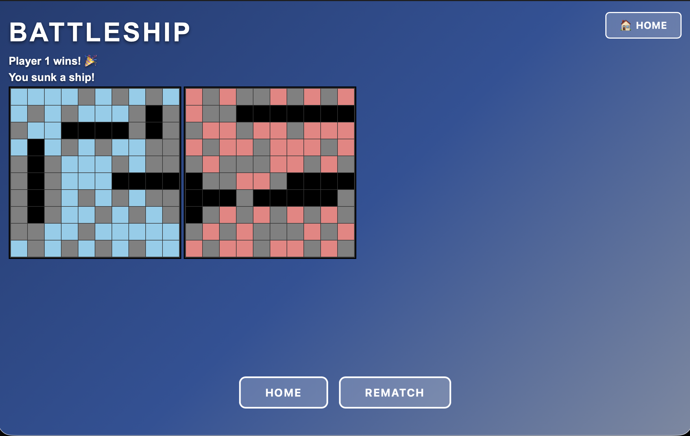
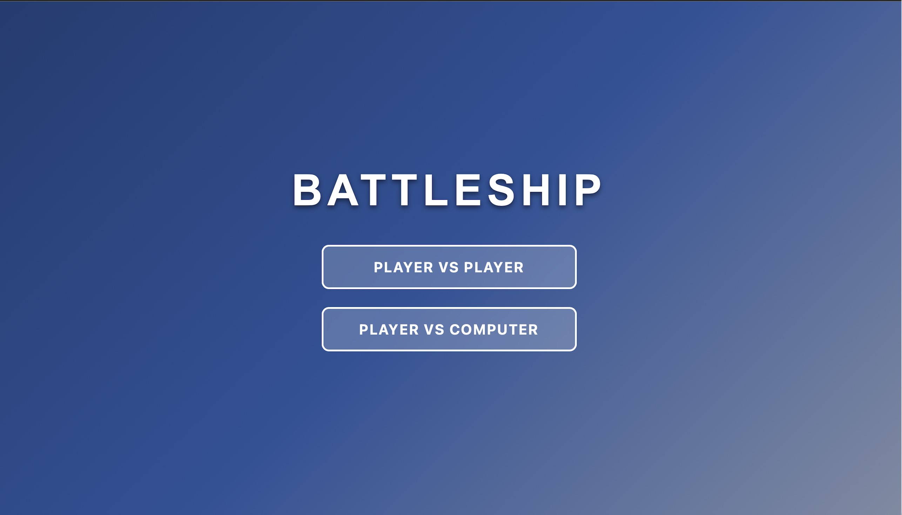
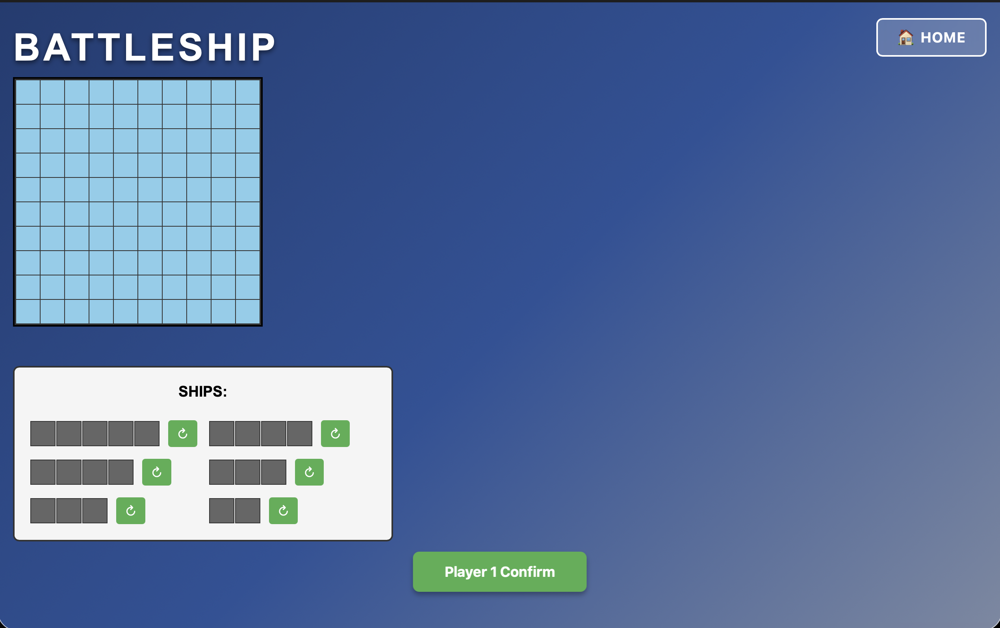

# 🚢 Battleship Game

A browser-based implementation of the classic Battleship game featuring drag-and-drop ship placement, intelligent AI opponent, and Player vs Player gameplay.

## 🎮 [Play Live Demo](https://teaghanjohnson.github.io/battleship/)



## ✨ Features

- **Two Game Modes**
  - Player vs Player: Take turns on the same device
  - Player vs Computer: Challenge an intelligent AI opponent

- **Intuitive Ship Placement**
  - Drag-and-drop interface for easy ship positioning
  - Rotation controls for flexible placement
  - Visual feedback for valid/invalid positions
  - Error handling to prevent overlapping ships

- **Smart AI Opponent**
  - Hunt-and-target algorithm for realistic gameplay
  - Switches between random search and targeted attacks
  - Tracks potential targets after successful hits

- **Clean, Modern UI**
  - Glass-morphism design with smooth animations
  - Real-time hit/miss/sunk indicators
  - Color-coded boards for easy tracking
  - Responsive visual feedback

- **Game Management**
  - Rematch functionality to play again quickly
  - Home button to switch game modes
  - Turn-based gameplay with clear indicators

## 🛠️ Technologies Used

- **Vanilla JavaScript (ES6+)** - Game logic and DOM manipulation
- **HTML5/CSS3** - Structure and modern styling
- **Object-Oriented Programming** - Class-based architecture with inheritance
- **CSS Grid** - Responsive game board layout
- **Drag and Drop API** - Interactive ship placement

## 🚀 Getting Started

### Play Online

Visit the [live demo](https://teaghanjohnson.github.io/battleship/) to play instantly in your browser.

### Run Locally

#### Prerequisites

- A modern web browser (Chrome, Firefox, Safari, or Edge)
- Git installed on your machine ([Download Git](https://git-scm.com/downloads))
- (Optional) A local development server or IDE with Live Server extension

#### Installation

1. **Clone the repository**

   ```bash
   git clone https://github.com/teaghanjohnson/battleship.git
   ```

2. **Navigate to the project directory**

   ```bash
   cd battleship
   ```

3. **Open the game**

   **Option A - Direct browser open:**
   ```bash
   # macOS
   open index.html

   # Windows
   start index.html

   # Linux
   xdg-open index.html
   ```

   **Option B - Using VS Code Live Server:**
   - Open the project folder in VS Code
   - Right-click on `index.html`
   - Select "Open with Live Server"

   **Option C - Using Python's built-in server:**
   ```bash
   # Python 3
   python -m http.server 8000

   # Then visit http://localhost:8000 in your browser
   ```

#### Running Tests

If you'd like to run the test suite:

```bash
# Install dev dependencies
npm install

# Run tests
npm test

# Run tests in watch mode
npm run test:watch

# Generate coverage report
npm run test:coverage
```

> **Note:** No build process required for the game itself - it's pure HTML, CSS, and JavaScript!

## 🎯 How to Play

### Setup Phase

1. Choose your game mode (Player vs Player or Player vs Computer)



2. Drag ships from the bank onto your board
3. Use the rotate button (↻) to change ship orientation
4. Click "Confirm" when all ships are placed



### Battle Phase

1. Click on your opponent's board to attack
2. Blue cells = water, Red cells = hit, Gray cells = miss, Black cells = sunk ship
3. Continue attacking until you miss, then it's the opponent's turn
4. First player to sink all enemy ships wins!

## 🧠 AI Implementation

The computer opponent uses a **hunt-and-target algorithm**:

- **Hunt Mode**: Fires at random cells until a ship is hit
- **Target Mode**: After a hit, intelligently searches adjacent cells
- **Smart Targeting**: Prioritizes likely ship locations based on previous hits
- **Memory Management**: Tracks attacked positions to avoid redundant moves

Implementation details can be found in [battleshipAI.js](battleshipAI.js).

## 📂 Project Structure

```
battleship/
├── index.html           # Main HTML structure and game containers
├── battleship.css       # Styling, animations, and responsive design
├── battleship.js        # Core game classes (Ship, GameBoard, Player)
├── gameUI.js            # UI handling, drag-and-drop, visual updates
├── game.js              # Game flow, modes (PvP/PvE), turn management
├── battleshipAI.js      # AI opponent logic and decision-making
└── README.md            # Project documentation
```

### Code Architecture

- **Separation of Concerns**: Logic, UI, and game flow are isolated
- **Inheritance**: `PvEGame` extends `PvPGame` for code reuse
- **Encapsulation**: Each class handles its own state and behavior
- **Event-Driven**: User interactions trigger game state updates

## 🎨 Design Decisions

- **No Framework**: Built with vanilla JavaScript to demonstrate core language skills
- **Class-Based OOP**: Uses ES6 classes for clean, maintainable code
- **Grid System**: 10x10 board matches traditional Battleship rules
- **Visual Feedback**: Immediate response to user actions for better UX
- **State Management**: Centralized game state for predictable behavior

## 🔮 Future Enhancements

- [ ] Mobile touch support for phones/tablets
- [ ] Sound effects for hits, misses, and victories
- [ ] Animations for ship placement and attacks
- [ ] Local storage for game statistics tracking
- [ ] Difficulty levels for AI (Easy, Medium, Hard)
- [ ] Network multiplayer for remote play
- [ ] Ship reveal at game end

## 📝 What I Learned

This project helped me develop skills in:

- Object-oriented programming and inheritance
- Algorithm implementation (AI hunt-and-target)
- DOM manipulation and event handling
- Drag-and-drop API implementation
- Game state management
- CSS animations and modern design
- Code organization and architecture

## 📄 License

MIT License - feel free to use this project for learning and experimentation!

## 👤 Author

**Teaghan Johnson**

[](https://github.com/teaghanjohnson)
[](https://linkedin.com/in/teaghanjohnson)

---

⭐ If you enjoyed this project or found it helpful, please consider giving it a star!
